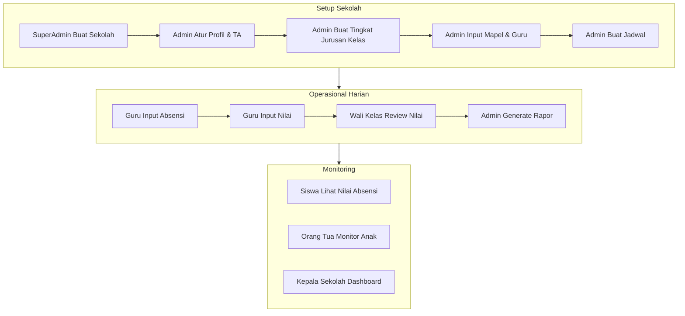

# Flow Bisnis Akademik — SIA Multi-Instansi

## 1. Flow Setup Sekolah (Inisialisasi)

```
Super Admin buat sekolah
    → Admin Sekolah login & atur profil sekolah (logo, kop, jenjang)
    → Buat Tahun Ajaran & set semester aktif
    → Buat Tingkat Kelas & Jurusan (jika SMK/SMA)
    → Buat Ruangan & Jam Pelajaran
    → Buat Kelas & assign Wali Kelas
    → Input Mata Pelajaran & kelompok mapel
    → Input data Guru & assign mapel pengampu
    → Input data Siswa & assign ke kelas
    → Link Orang Tua ke Siswa
    → Buat User & assign role
    → Buat Jadwal Pelajaran
    → Konfigurasi bobot penilaian & skala predikat
```

## 2. Flow Tahun Ajaran

```
Admin buat Tahun Ajaran (contoh: 2025/2026)
    → Buat Semester 1 (Ganjil) & Semester 2 (Genap)
    → Set TA sebagai aktif (TA lama otomatis nonaktif)
    → Semua operasional mengacu ke TA & semester aktif
    → Akhir tahun: lock semester → generate rapor → arsip TA
```

## 3. Flow Pendaftaran Siswa

```
Admin/TU input biodata siswa
    → Generate NIS otomatis (format dari school_settings)
    → Assign ke kelas & TA aktif
    → Upload foto
    → Input riwayat pendidikan sebelumnya
    → Link orang tua (Ayah/Ibu/Wali)
    → Buat akun user siswa (opsional)
    → Status: aktif / mutasi / lulus / keluar / nonaktif
```

## 4. Flow Absensi Harian

```
Guru/Wali Kelas buka halaman absensi kelas
    → Pilih tanggal (default: hari ini)
    → Sistem tampilkan daftar siswa kelas
    → Tandai status: Hadir (H) / Sakit (S) / Izin (I) / Alpha (A)
    → Simpan absensi
    → Sistem update rekap absensi (attendance_summaries)
    → Siswa & Orang Tua dapat melihat rekap
```

## 5. Flow Penilaian

```
Admin konfigurasi komponen penilaian (bobot %)
    → Guru buat assessment (Tugas/Ulangan/UTS/UAS) per mapel & kelas
    → Guru input nilai per siswa per assessment
    → Sistem hitung nilai akhir per mapel:
        Nilai Akhir = Σ (nilai_komponen × bobot_komponen)
    → Sistem tentukan predikat dari grade_scales
    → Wali Kelas review & approve
    → Admin/Kepala Sekolah lock nilai semester
```

## 6. Flow Rapor Semester

```
Semester di-lock oleh Admin
    → Sistem generate report_cards per siswa
    → Isi report_card_details (nilai per mapel + predikat + deskripsi)
    → Wali Kelas input catatan wali kelas
    → Set tanda tangan digital (Kepala Sekolah, Wali Kelas)
    → Cetak PDF rapor dengan kop sekolah
    → Distribusi ke siswa/orang tua
```

## 7. Flow Pembayaran

```
Admin/TU buat jenis biaya (SPP, daftar ulang, kegiatan)
    → Generate tagihan (payment_bills) per siswa per periode
    → TU input pembayaran (payment_records)
    → Sistem update status: belum bayar / sebagian / lunas
    → Orang Tua lihat tagihan & riwayat via portal
    → Export laporan pembayaran PDF/Excel
```

## 8. Flow E-Learning

```
Guru upload materi pembelajaran (file/link) per mapel & kelas
    → Guru buat tugas (assignment) dengan deadline
    → Siswa download materi & upload jawaban tugas
    → Guru nilai submission (assignment_grades)
    → Nilai tugas e-learning dapat diintegrasikan ke komponen penilaian
```

## 9. Flow Pengumuman

```
Admin/Guru/Kepala Sekolah buat pengumuman
    → Set target: semua / per role / per kelas
    → Publish pengumuman
    → Notifikasi tampil di dashboard target user
    → Agenda akademik ditampilkan di kalender dashboard
```

## 10. Flow Monitoring

### Siswa
Login → Dashboard → Lihat jadwal, nilai, absensi, pengumuman, tugas e-learning

### Orang Tua
Login → Pilih anak → Lihat nilai, absensi, pengumuman, tagihan pembayaran

### Kepala Sekolah
Login → Dashboard statistik → Laporan akademik → Approve rapor

## 11. Diagram Alur Utama


