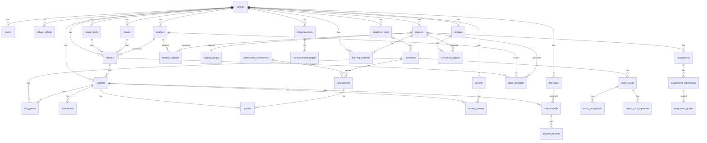

# ERD dan Relasi Tabel — SIA Multi-Instansi

## Diagram ERD

---

## Daftar Tabel (~45 tabel)

### Tenant & Auth
| Tabel | Kolom Utama |
|-------|-------------|
| `schools` | id, name, slug, logo, address, phone, email, website, education_level, is_active |
| `school_settings` | id, school_id, key, value (JSON) |
| `users` | id, school_id, name, email, password, profile_type, profile_id, is_active |
| `login_histories` | id, user_id, ip_address, user_agent, logged_in_at |
| `activity_log` | (Spatie package) |

### Tahun Ajaran & Kurikulum
| Tabel | Kolom Utama |
|-------|-------------|
| `academic_years` | id, school_id, name, start_date, end_date, is_active |
| `semesters` | id, school_id, academic_year_id, name, semester_number, start_date, end_date, is_active, is_locked |
| `curricula` | id, school_id, name, description, is_active |
| `curriculum_subjects` | id, school_id, curriculum_id, subject_id, grade_level_id, hours_per_week |
| `education_levels` | id, name, code, min_grade, max_grade |

### Master Akademik
| Tabel | Kolom Utama |
|-------|-------------|
| `grade_levels` | id, school_id, name, level_number, description |
| `majors` | id, school_id, name, code, description |
| `classes` | id, school_id, academic_year_id, grade_level_id, major_id, name, homeroom_teacher_id, capacity |
| `rooms` | id, school_id, name, capacity, location |
| `lesson_hours` | id, school_id, name, start_time, end_time, order |
| `subjects` | id, school_id, subject_group_id, code, name, description |
| `subject_groups` | id, school_id, name, description |
| `teacher_subjects` | id, school_id, teacher_id, subject_id, class_id |

### People
| Tabel | Kolom Utama |
|-------|-------------|
| `students` | id, school_id, class_id, user_id, nis, nisn, name, gender, birth_place, birth_date, religion, address, phone, photo, status, enrolled_at |
| `student_biodatas` | id, school_id, student_id, blood_type, height, weight, disabilities, notes |
| `student_education_histories` | id, school_id, student_id, school_name, grade_level, year, certificate_number |
| `teachers` | id, school_id, user_id, nip, name, gender, birth_place, birth_date, religion, address, phone, photo, specialization, status, joined_at |
| `teacher_education_histories` | id, school_id, teacher_id, institution, degree, major, year |
| `parents` | id, school_id, user_id, name, gender, phone, email, occupation, address |
| `student_parents` | id, school_id, student_id, parent_id, relationship (ayah/ibu/wali), is_primary |

### Jadwal
| Tabel | Kolom Utama |
|-------|-------------|
| `class_schedules` | id, school_id, class_id, subject_id, teacher_id, room_id, lesson_hour_id, day (enum), semester_id |

### Absensi
| Tabel | Kolom Utama |
|-------|-------------|
| `attendances` | id, school_id, student_id, class_id, date, status (H/S/I/A), notes, recorded_by |
| `attendance_summaries` | id, school_id, student_id, class_id, month, year, present, sick, permission, absent |

### Penilaian
| Tabel | Kolom Utama |
|-------|-------------|
| `assessment_components` | id, school_id, name, code, weight, order |
| `assessments` | id, school_id, semester_id, subject_id, class_id, component_id, name, max_score, date |
| `grades` | id, school_id, student_id, assessment_id, score, notes |
| `grade_scales` | id, school_id, min_score, max_score, grade_letter, description |
| `final_grades` | id, school_id, student_id, subject_id, semester_id, score, grade_letter, description |

### Rapor
| Tabel | Kolom Utama |
|-------|-------------|
| `report_cards` | id, school_id, student_id, semester_id, class_id, homeroom_notes, status, generated_at |
| `report_card_details` | id, report_card_id, subject_id, score, grade_letter, description |
| `report_card_signatures` | id, report_card_id, role, name, signature_image, signed_at |

### Pengumuman
| Tabel | Kolom Utama |
|-------|-------------|
| `announcements` | id, school_id, title, content, type, published_at, expires_at, created_by |
| `announcement_targets` | id, announcement_id, target_type (role/class/all), target_id |

### Pembayaran
| Tabel | Kolom Utama |
|-------|-------------|
| `fee_types` | id, school_id, name, code, amount, description, is_recurring |
| `payment_bills` | id, school_id, student_id, fee_type_id, amount, due_date, period, status |
| `payment_records` | id, school_id, payment_bill_id, amount, payment_date, method, reference, notes, recorded_by |

### E-Learning
| Tabel | Kolom Utama |
|-------|-------------|
| `learning_materials` | id, school_id, subject_id, class_id, title, description, file_path, url, created_by |
| `assignments` | id, school_id, subject_id, class_id, title, description, deadline, max_score, created_by |
| `assignment_submissions` | id, school_id, assignment_id, student_id, file_path, submitted_at, status |
| `assignment_grades` | id, school_id, submission_id, score, feedback, graded_by, graded_at |

### Spatie Permission
| Tabel | Deskripsi |
|-------|-----------|
| `roles` | Role definitions |
| `permissions` | Permission definitions |
| `model_has_roles` | User-role pivot |
| `model_has_permissions` | Direct user permissions |
| `role_has_permissions` | Role-permission pivot |

---

## Konvensi Kolom

Semua tabel tenant-scoped memiliki:
- `id` — BIGINT UNSIGNED PK AUTO_INCREMENT
- `school_id` — BIGINT UNSIGNED FK → schools.id (kecuali global: users super admin, education_levels, Spatie tables)
- `created_at`, `updated_at` — TIMESTAMP
- `deleted_at` — TIMESTAMP NULL (soft delete)
- `created_by`, `updated_by` — BIGINT UNSIGNED FK → users.id (nullable)

## Relasi Kunci

1. **users.profile_type + profile_id** — polymorphic ke Student/Teacher/Parent
2. **classes.homeroom_teacher_id** → teachers.id
3. **final_grades** — UNIQUE (student_id, subject_id, semester_id)
4. **attendances** — UNIQUE (student_id, date)
5. **BelongsToSchool trait** — global scope pada semua model tenant

## Index Penting

- `school_id` pada semua tabel tenant
- `(school_id, nis)` UNIQUE pada students
- `(school_id, nip)` UNIQUE pada teachers
- `(student_id, date)` UNIQUE pada attendances
- `(student_id, subject_id, semester_id)` UNIQUE pada final_grades
